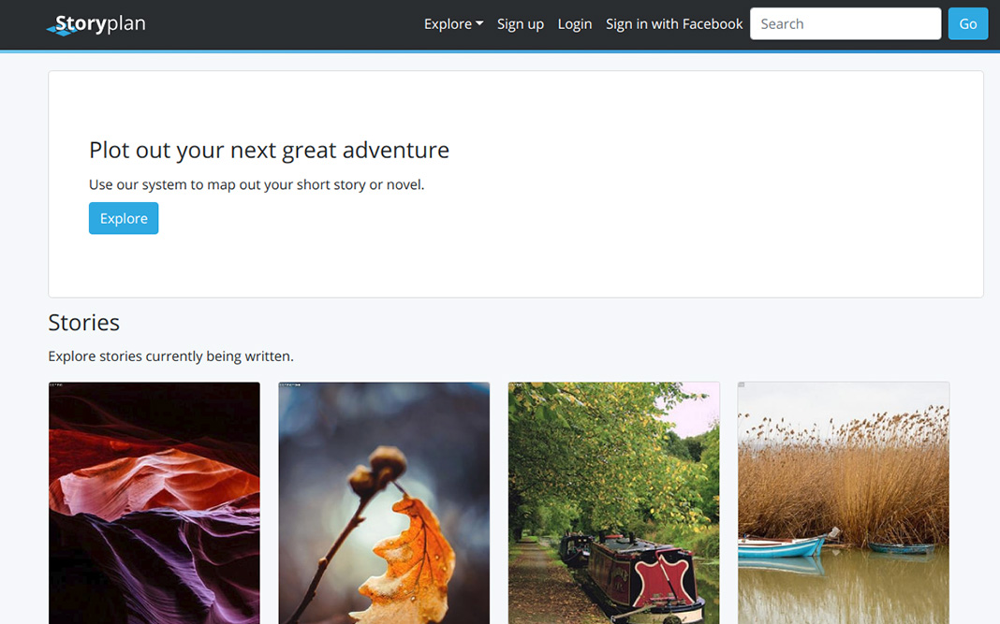

# Rails Storyplan

Storyplan is a narrative development tool built using [Rails][rails] to help users plan out stories and connect with others as their projects evolve. It has started out as a CRUD application involving the creation of stories, chapters, and characters, but there is room for greater functionality going forward.

## Demo App
You can see a demo version of the application deployed to Heroku here: https://rails-storyplan.herokuapp.com/

## Functionality
Users can create an account either manually or via Facebook. They can create stories and associate chapters with them to flesh them out and develop narrative structure. Users can create characters that can be associated with chapters they appear in, but can also exist independently, offering the option to begin story planning with characters first.

In addition to creating models, users can view the stories, chapters, and characters of other writers as well, sortable through different paths (such as audiences or genres).

## Application Info
- Authentication (user registration and login) is handled by the [Rails Devise][devise] gem. Facebook authentication is enabled via OAuth for Devise.
- The back end uses [ActiveRecord][active-record] as the ORM. It uses [PostgreSQL][postgres] for the database via the [pg gem][pg].
- The front end leverages Bootstrap 4 via the [Bootstrap gem][bootstrap-gem] in conjunction with Rails ERB templates. Styling uses [SCSS][scss]. The JavaScript assets are built using [Webpack][webpacker].
- Pagination uses the [Kaminari gem][kaminari].
- Image uploading is managed by the [Rails Paperclip][paperclip]. For production, it's configured to use [AWS S3][s3] to store images.

## Install Instructions
In order to get the application to work, install dependencies from the [Gemfile][gemfile] via [Bundler][bundler] by running `bundle install`.

Since the application uses PostgreSQL, you need to have it installed locally on your machine with a user that has table creation privileges. You can get further instructions [here][postgres-local-setup]. If you'd rather not bother with PostgreSQL, you can use an older version of the application that uses SQLite3 [here][old-version-1].

Create the database with `bundle exec rails db:create` and run migrations with `bundle exec rails db:migrate`, then run `bundle exec rails db:seed` to populate the database. You need to seed, or else there will be no genres or audiences. In order to get OAuth to work, you need a .env file with a secret and application key for Facebook.

To run the application in development mode after installation, run `rails s`.

Front end dependencies are managed by [Yarn][yarn] with the [package.json][package.json] file. They are built by Webpack via the [Webpacker gem][webpacker]. Custom JavaScript code is located in the [`app/javascript`][js-directory] where front end assets are imported.

For production, the application is configured to use [AWS S3][s3] for image uploads. You can read more about setting up S3 [here][heroku-s3-setup] (with Heroku).

## Testing
The test suite is developed using Rspec via the [rspec-rails gem][rspec-rails] with [shoulda-matchers][shoulda]. [Capybara][capybara] is used for integration (feature) testing to mimic user browser interaction, while model factories are set up with [FactoryBot][factory-bot].

Tests are located under the [`/spec`][spec-directory] folder. Model and controller level tests are fairly comprehensive, while feature tests only test core CRUD functionality right now. In order to run tests, run `bundle exec rspec` followed by an optional folder or file under the [`/spec`][spec-directory] directory (for example, if you only want to test models, run `bundle exec rspec spec/models`).

## More Info
For more, see this post: http://mitulmistry.github.io/ruby/rails/rails-project/

This project began as a Rails assessment for Flatiron School's Learn Verified Full Stack Development program:
https://github.com/learn-co-students/rails-assessment-v-000

## License
This project is open source under the terms of the [MIT License][mit].

[rails]: http://rubyonrails.org/
[devise]: https://github.com/plataformatec/devise
[active-record]: http://guides.rubyonrails.org/active_record_basics.html
[postgres]: https://www.postgresql.org/
[pg]: https://github.com/ged/ruby-pg
[bootstrap-gem]: https://github.com/twbs/bootstrap-rubygem
[scss]: http://sass-lang.com/
[kaminari]: https://github.com/kaminari/kaminari
[paperclip]: https://github.com/thoughtbot/paperclip
[s3]: https://aws.amazon.com/s3/
[bundler]: http://bundler.io/
[gemfile]: https://github.com/MitulMistry/rails-storyplan/blob/master/Gemfile
[postgres-local-setup]: https://devcenter.heroku.com/articles/heroku-postgresql#local-setup
[old-version-1]: https://github.com/MitulMistry/rails-storyplan/tree/0ef797e90b02720d9f6c44a22a99bea8388c1bc8
[webpacker]: https://github.com/rails/webpacker
[yarn]: https://yarnpkg.com/en/
[package.json]: https://github.com/MitulMistry/rails-storyplan/blob/master/package.json
[js-directory]: https://github.com/MitulMistry/rails-storyplan/blob/master/app/javascript
[heroku-s3-setup]: https://devcenter.heroku.com/articles/s3
[rspec-rails]: https://github.com/rspec/rspec-rails
[shoulda]: https://github.com/thoughtbot/shoulda-matchers
[capybara]: https://github.com/teamcapybara/capybara
[factory-bot]: https://github.com/thoughtbot/factory_bot_rails
[spec-directory]: https://github.com/MitulMistry/rails-storyplan/blob/master/spec
[mit]: http://opensource.org/licenses/MIT
